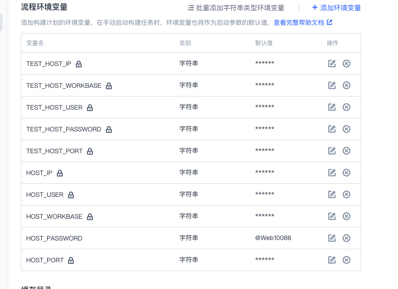

## 

## 简单的前端项目如何部署到一个机器上

#### 环境要求：

- 一台有docker的虚拟机 （作为部署的机器）

- 一台部署了对应jenkins虚拟机（触发cicd构建和部署的相关流程）

- 一台部署了Harbor的虚拟机 （用于保存构建过程中产生的镜像）

> ⚠️注意：三台机器不要求时外网，但是要保证 三台机器能够互相访问。这里我公司都有对应的内网机器提供，实际使用看只要保证三台机器能相互访问即可

#### 部署具体流程

###### 1.构建nginx和node基础镜像推送到harbor

1.从dockerhub 中拉取nginx 和 node 的镜像并 重命名镜像名和tag

```dockerfile
docker pull nginx:1.21.5
docker tag nginx:1.21.5 harbor.smoa.cloud/base_front/nginx:1.21.5

// node 操作同理即可
```

> ⚠️这一步主要时防止构建访问太多次外网(可能被禁用)和提高构建速度的，如果你们的项目不要求这个可以不用做

###### 2.项目中编写Dockerfile

在项目的中编写一个dockerfile用于构建简单的镜像:

```dockerfile
FROM harbor.smoa.cloud/base_front/node:16-alpine AS builder

WORKDIR /

COPY . .

RUN yarn
RUN yarn build

FROM harbor.smoa.cloud/library/nginx:1.21.5

COPY  --from=builder /dist/ /usr/share/nginx/html
```

> ⚠️说明： 这里的基础镜像可以通过访问自己部署的harbor来拿，防止构建过程要访问外网（存在限制，网速不好）

##### 3.在开发机器中编写部署的脚本,并保存到PATH下,方便访问

脚本如下：

```shell
#bin/bash
#主要是用于更新的时候，找到上次部署的id
ps_name=server_name 

#根据名称找到上次部署的CONTAINER ID,停止并删除该容器
ps_id=`docker ps -aqf "name=$ps_name"`
echo $ps_id
docker stop $ps_id
docker rm $ps_id

# 用同一个名称部署容器，方便下次部署时找到并删除该容器
docker run -d -p 8080:8080 --name=$ps_name -v /root/rdem-front/nginx.conf:/etc/nginx/nginx.conf devops-docker.pkg.coding.smoa.cloud/rdem/application/front:$1
```

##### 4.编写jenkins并配置相关的环境变量

```jenkins
pipeline {
  agent any
  stages {
    stage('检出') {
      steps {
        checkout([
          $class: 'GitSCM',
          branches: [[name: GIT_BUILD_REF]],
          userRemoteConfigs: [[
            url: GIT_REPO_URL,
            credentialsId: CREDENTIALS_ID
          ]]])
        }
      }

    stage('自定义构建过程') {
      steps {
        script {
          docker.withRegistry(
            "${CCI_CURRENT_WEB_PROTOCOL}://${CCI_CURRENT_TEAM}-${CCI_DOCKER_REGISTRY_DOMAIN}",
            "${env.DOCKER_REGISTRY_CREDENTIALS_ID}"
          ) {
            def dockerImage = docker.build("${PROJECT_NAME.toLowerCase()}/application/front:\${GIT_TAG:-tag}", "-f Dockerfile .")
            dockerImage.push()
          }
        }

      }
    }

    stage('自定义部署流程') {
      steps {
        script {
          def remote = [:]
          if (env.GIT_TAG =~ 'test*') {
            remote.name = "test"
            remote.host = "${TEST_HOST_IP}"
            remote.user = "${TEST_HOST_USER}"
            remote.password = "${TEST_HOST_PASSWORD}"
            remote.allowAnyHosts = true
          } else if (env.GIT_TAG =~ 'v*') {
            remote.name = "online"
            remote.host = "${HOST_IP}"
            remote.user = "${HOST_USER}"
            remote.password = "${HOST_PASSWORD}"
            remote.allowAnyHosts = true
          }

          sshCommand remote: remote, command: "rdem_front.sh ${GIT_TAG}"
        }
      }
    }
  }
}
```

相关变量: 

    
